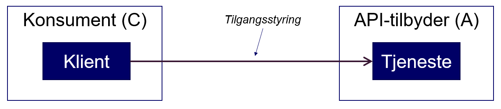
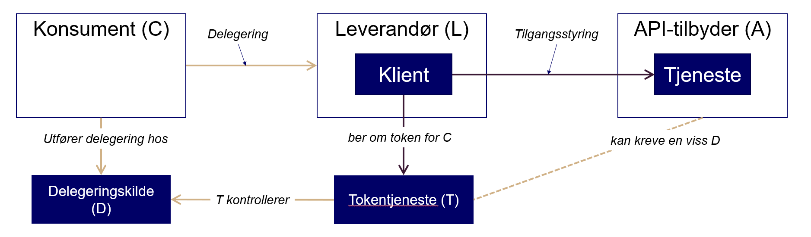
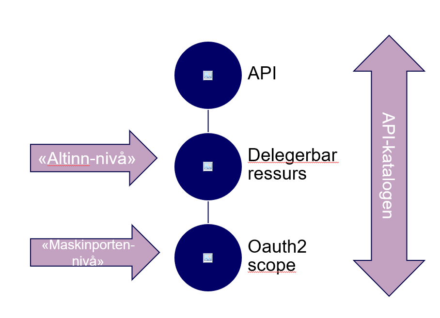

## Overordnet beskrivelse

eOppslag støtter to varianter av samhandling:

### Direkte samhandling:

Følgende aktører og prosesser inngår i arkitekturen:

* Klienten (en applikasjon) kaller tjenesten tilbudt av «API-tilbyder» (A), på vegne av virksomhet «Konsument» C
* API-tilbyder (A) bestemmer hvilke konsumenter som får lov å kalle tjenesten (autorisering)
* Tjenesten kan nå styre hvilke data som returneres avhengig av hvem som kaller.

### Samhandling delegert til leverandør

I mange brukstilfeller kjøper Konsument en ferdig løsning (feks skytjeneste) fra en Leverandør, i stedet for å lage en klient selv. Da er det behov for delegering:

* Leverandør (L) sin klient kaller tjenesten på vegne av Konsument (C)
* Konsument (C) delegerer myndighet til Leverandør (L) for tjenesten
  - Dette gjøres hos en Delegeringskilde (D)
  - Delegeringen er en avtale mellom Konsument (C) og Leverandør (L) og styres av konsument.
* Tilgangsstyringen i tjenesten er knyttet til konsumenten (C), ikke leverandør. Dette styres fortsatt av API-tilbyder
* API-tilbyder kan definere at et gitt API kun aksepterer delegeringer utført hos en gitt delegeringskilde (D)
* Ved tokenutstedelse må Leverandøren oppgi hvilken konsument han opptrer på vegne av
  - kan evt. peke på hvilken delegeringskilde som er autorativ for delegeringsforholdet
  - Tokentjenesten sjekker delegeringskilden ved hver tokenutstedelse

##  Forhold til fellesløsninger

Modellen over er generisk.  I første iterasjon av arkitekturen er følgende lagt til grunn:

* Selve API-sikringen blir realisert med "server-to-server" Oauth2
* Token-tjenesten (T) realiseres av ID-porten sin OIDC provider
* Delegeringskilden (D) realiseres av Altinn Autorisasjon
* For å oppnå samspill med API-katalogen, må vi
  - innføre noen norske utvidelser til OpenAPI-spesifikasjon
  - definere en konvensjon for hvordan bruke OAS

Ett API kan inneholde en eller flere delegerbare ressurser,  og et Oauth2 scope kan tilhøre et eller flere delegerbare ressurser.  Token-tjenesten forholder seg kun til oauth2 scopes. Delegeringskilden forholder seg primært til delegerbare ressurser, men er også ansvarlig for å vedlikeholde hvilke scopes som hører til en delegerbar ressurs.

Modellen forsøker å rendyre ansvarsområdene mellom  tokentjeneste og delegeringskilde.

## Begreper

* Konsumenter
* API-tilbyder
* Leverandør
* Token-tjeneste
* Delegeringskilde
* API-katalog
* Klient
* Tjeneste

### Referanser

* https://developers.google.com/identity/protocols/OAuth2ServiceAccount
* https://difi.github.io/idporten-oidc-dokumentasjon/oidc_auth_server-to-server-oauth2.html
* [RFC6749 The OAuth 2.0 Authorization Framework](https://tools.ietf.org/html/rfc6749)
* [RFC7523 JSON Web Token (JWT) Profile for OAuth 2.0 Client Authentication and Authorization Grants](https://tools.ietf.org/html/rfc7523)
* altinn autorisasjon github
* eOppslag referansearkitektur
*
