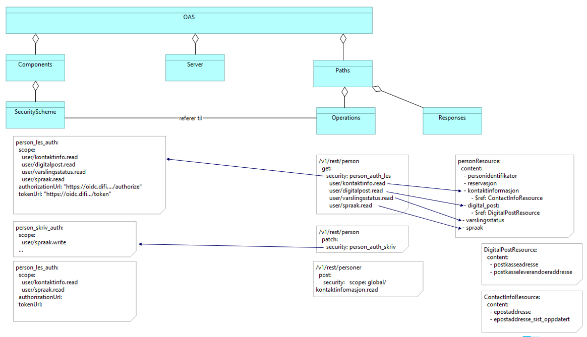

På denne siden gir vi retningslinjer for hvordan API-tilbydere skal navngi sine Oauth2 scopes.

`scope`-begrepet er sentralt i Oauth2 sin autorisasjonsmodell. Et scope kan best beskrives som en *ressurs-definisjon*. Tokens er som hovedregel knyttet (og derigjenomm begrenset) til et eller flere scopes.


## Oppsummering

tbw

## Typer ressurser og scopes

Noen scopes/ressursdefinisjoner  vil i praksis være entydig koblet mot den organisasjonen som forvalter et datasett (eksempel Bostedsadresse i Folkeregisteret), men andre ressurser kan sees på som globale der mange organisasjoner kan tenkes å kunne levere ut en fornuftig respons som svar på en forespørsel etter den aktuelle ressursen. Vi ser at det da ikke nødvendigvis er en 1:1 mapping mellom API-tilbyder og scope.

En API-tilbyder tilbyr data gjennom ett eller flere APIer, potensielt realisert med flere API-endepunkter. Tilbyderen kan velge å beskytte flere endepunkter bak samme scope.  Tilbyderen kan også velge å ha ett endepunkt, og bruke granulære/hierariske scopes for å gi konsumenten "rike" eller "tynne" responser. Motivasjonen kan være dataminimering, enten fordi konsumenten kan få lov til å bestemme hvilke ressurser som behøves, eller hvilke rettigheter konsumenten har.

## Syntaks

https://tools.ietf.org/html/rfc6749?#section-3.3
```
     scope       = scope-token *( SP scope-token )
     scope-token = 1*( %x21 / %x23-5B / %x5D-7E )
```


I noen sektorer er det standarderer som definerer hvilke scopes som skal brukes.  Et typisk eksempel her er den internasjonale Smart-on-FHIR standarden i helsesektoren, som definerer scope etter syntaksen:

```
clinical-scope ::= ( 'patient' | 'user' ) '/' ( fhir-resource | '*' ) '.' ( 'read' | 'write' | '*' )
```


(se [http://docs.smarthealthit.org/authorization/scopes-and-launch-context/](http://docs.smarthealthit.org/authorization/scopes-and-launch-context/))
Andre sektorer kan følge andre syntakser som ikke er kompatible med denne syntaksen, og vi ser da at det ikke er realistisk å skulle *tvinge* en bestemt syntaks i norsk offentlig forvaltning.

### Forslag

I eOppslag legger vi opp til en syntaks:

```
scope ::= prefix ':' subscope
```

der `prefix` er en tekststreng som blir manuelt tildelt en virksomhet. En virksomhet kan ha flere prefix.  Eksempel på prefix kan være `nav` eller `skatt`. Å bruke organisasjonnummer kan i noen sammenhenger være nyttig, siden det kan legge til rette for automatiserte prosesser. I andre sammenhenger vil ikke organisasjonsnummer være tilstrekkelig granulært for store virksomheter.

Difi ønsker å gi API-tilbydere stor frihet til å selv bestemme hvilken semantikk de har behov for.  Samtidig mener vi at som hovedregel bør API-tilbyder (A) være koda inn i scopet. (Merk at )

Vi får da:

- prefix bør identifisere din virksomhet  (for eksempel `nav` eller `folkeregisteret` eller organisasjonsnummer)
    - dersom flere virksomheter bruker samme scope, bør prefix være sektoridentifiserende (`forsikring`)
- subscope bør identifisere ressursen best mulig (`trygdeopplysninger` eller `adresse`)
- subscope kan gjerne ha ulike postfix for å skille på lese- og skrive-tilgang til ressursen (`user/spraak.write`)
     - fravær av postfix bør i utgangspunktet tolkes som kun lese-tilgang

## Forhold til API-katalogen


"ting i API-katalogen, eOpplag, Maskinporten, Altinn,...  må henge sammen"

begrep:
- 1 API-tilbyder har flere API
- 1 API i api-katalog  
- 1 API = 1 OAS-fil
- 1 API = mange eOpplag scopes
- 1 eOppslag scope = 1 Oauth2 scope
- 1 oauth2 scope = 1 scope i API-katalog


  - APIet skal vere tilgjengeleg på 1 og berre 1 domene
    - Produksjons-APIet skal angis med OAS definsjonen /Server/url/description="prod"
    - Test-API tilsvarande med "test"

-


|OAS|Oauth2|Døme|Kommentar|lenker|
|-|-|-|-|-|
| /Server/url   | `aud` (og `iss`) | https://protected.example.net/resource | i Oauth2 blir 'aud' og 'iss' ofte satt til client-id, men for en ressursserver (API) bør en heller bruke baseurl til APIet.  | https://github.com/OAI/OpenAPI-Specification/blob/master/versions/3.0.1.md#serverObject https://tools.ietf.org/html/draft-ietf-oauth-resource-indicators-00  |
|   |   |   |   |
| /Server/description   |   | 'prod' for URL til produksjonsmiljø, 'test' for testmiljøer  |


#### døme frå krr

