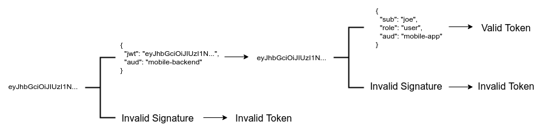

## Krav

Ressursserver skal kunne...

* identifisere virksomheter vha organsisasjonsnummer
* alltid identifisere den jurdiske konsumenten
  * også om denne ikke opererer en egen oauth klient
* kunne utlede styrken på identi


Generelt
* eoppslag-toke må lett kunne leve i parallell med fremtige token som kommuniserer andre representasjonsforhold
* bør støtte både sentralisert og distribuert infrastruktur  
  - sentralisert: all logikk i en og samme autorisasjonsserver)
  - desentralisert: klient, AS eller ressurs-server "sender token hit og dit" mellom flere AS og STSer,  slutt-tokenet bør vere identisk


## Mulige realiseringer

Det finst flere alternative "inspirasjonskilder" som vi kan skjele til

- propiertære JWTer
- token exchange
- nested JWTs   
- Vectors of trust
- "krav til sikkerhetsbillett ved deling av helseopplysninger"


### Oppsummert:

<table>
<tr>
<th>Priorietær</th>
<th>Token exchange</th>
<th>Nested JWT</th>
<th>Vectors of Trust</th>
<th>Helsesektoren</th>
</tr>

<tr>
<td>
<pre>
{
  "consumer_orgno": 999888777
  "supplier_orgno": 888111222
}
</pre>

eller tilogmed norsk?

<pre>
{
  "konsument": 999888777
  "leverandør": 888111222
}
</pre>

</td>

<td>
<pre>
{
  "orgno": 999888777
  "act": {
    "orgno": 888111222
  }
}
</pre>
</td>

<td>
<pre>
{
  "orgno": 999888777
  "jwt": "ey......"
  }
}
</pre>
der indre JWT er
<pre>
{
   "orgno": 888111222
}
</pre
</td>

<td>
<pre>
</pre
</td>

<td>
<pre>
"helse://client/requester":
{
  "resourceType": "HealthcareService ",
  "identifier": {
    "system": "urn:oid:2.16.578.1.12.4.1.2.102",
    "value": "client_id"
  },
  "provideBy": {
    "Organization": {
      "identifier": {
        "system": "urn:oid:2.16.578.1.12.4.1.2.101",
        "value": "999888777"
      }}},
  "provideBy": {
    "Organization": {
      "identifier": {
        "system": "urn:oid:2.16.578.1.12.4.1.2.101",
        "value": "888111222"
      }}},
 "name": "HSØ responssenter"
}
</pre>
</td>

</tr>
</table>


#### token exhange:

- https://tools.ietf.org/html/draft-ietf-oauth-token-exchange-16
- i eoppslag:  delegatio has occured -> bruke `act`-claim (og ikkje 'may_act')
- virkar fornuftig å bruke orgno både for konsuemnt og leverandør


#### nested jwt:

- del av basic JWT spec (https://tools.ietf.org/html/rfc7519)
- ser typisk slik ut: 
- krav til samme metode for identifisering av konsument, medfører at indre JWT må vere representasjon av leverandøren
  - denne kan / bør vere signert av delegeringskilde og ikkje AS
    - som blir tungtvindt, sidan mest naturleg at delegeriskjelde vert


#### vectors of trust
- https://tools.ietf.org/html/rfc8485
- inspirert av NIST 800-63 kan det sjå ut som
- fokuserer på individet som blir autentisering, og returnerer ein `vot`-claim som ein struktur som fortel både om identitetstfastsettelse, autentiseringstyrke, føderasjonssstyrke, tillitsrammeverk, etc.
- ser **ikkje** ut til å ha noko om delegering ?


#### helse

- "tungt" format inspirert av FHIR-standarden.
- ser ikkje ut til å spesifisere org. på vegne av annan org.  (ennå)

```
"helse://client/requester":
{
  "resourceType": "HealthcareService ",
  "identifier": {
    "system": "urn:oid:2.16.578.1.12.4.1.2.102",
    "value": "<RESH-id>"
  },
  "provideBy": {
    "Organization": {
      "identifier": {
        "system": "urn:oid:2.16.578.1.12.4.1.2.101",
        "value": "<orgnr>"
      }}},
 "name": "HSØ responssenter"
}
```


### Claims felles for alle alternativ:

"iss": "https://oidc..."


## Pros/Cons

Vurderingskriteria ?

- produktstøtte
- **grad av "proprietæritet"**,  prøve å bruke eksisterene claims til "noko som ligner"?
- utvidbar / gjenbrukbar
- kva gjer andre ?


| faktor   | Priorietær | Token exchange |Nested JWT|Vectors of Trust| "helse" |
|-|-|-|-|-|-|
| spec-status   | RFC  | Snart RFC  | RFC  |  RFC  |   |
| produktstøtte  | Nei.  Men relativt lett å håndtere custom claims i dei fleste bibl. |  Begrenset ?  | Veit ikkje  | Veit ikkje   |  Ikkje enno |
| Implementasjonskonsekvens   | Liten/neglisjerbar| Liten  | Potensielt få produkt å velge i |   |
| utvidbar / gjenbrukbar  | Nei.  Men relativt lett å håndtere custom claims i dei fleste bibl. |  Begrenser  |   |   |
|  proprietær-grad | Ja |  Delvis |   |   |
| kva gjer andre   |  |    |   |   |


## Ulike tokens som må støttes

Det er viktig å standardisere innhold i ulike typer tokens slik at konsumenter/tilbydere ikke blir usikre i hvilke virksomhetsprosesser tokenet kan brukes.

Vi kjenner p.t. følgende ulike scenario:

* Vanlige innloggingstoken (id_token) over OpenID connect
* Ansattinnlogging: id_token som forteller hvor en person er ansatt
* Tilgangstoken (access_token) for innbyggerstyrt API-sikring (autentiseringsnær autorisasjon)
* Tilgangstoken for maskin-til-maskin API-sikring
* Ulike varianter av tilgangstoken der det har skjedd en delegering eller token-berikelse fra passende autorativ kilde.

## Beskrivelse av viktige claims

Standardiserte claims:

|claim|spec'|kommentar|
|-|-|-|
|scope|oauth2|ressursen som vert beskytta|
|sub|OIDC, JWT|OIDC: unik, tjenestespesifikk ikke-meningsbærende identifikator(strengt matematisk definert), JWT:  The "sub" (subject) claim identifies the principal that is the  subject of the JWT. |
|aud|OIDC, JWT| audience. OIDC:  klienten som har mottatt id_token.  JWT:The "aud" (audience) claim identifies the recipients that the JWT is intended for.|
|act|Token Exchange|The "act" (actor) claim provides a means within a JWT to express that    delegation has occurred and identify the acting party to whom authority has been delegated.|
|may_act|Token Exchange |The "may_act" claim makes a statement that one party is authorized to  become the actor and act on behalf of another party.||client_orgno||944117784|974761076|999888777 (Storbanken)|777888999 (Lillebanken)|936796702
|acr| OIDC |Sikkerhetsnivå (Auth. context class ref. )|
|amr| OIDC| Autentiseringsmetode|
|client_id|Oauth2 | identifikator for klient, ikke nødvendigvis meningsbærende|

Proprietære "norske" claims:

|claim|spec'|kommentar|status|
|-|-|-|-|
|pid| Kontaktregisteret | personidentifikator i folkeregisteret (burde heitt folkeregisteridentifikator)|i bruk i id-porten|
|orgno| Enhetsregisteret| Organisasjonsnummer|
| client_orgno| | (Norsk) organisasjonsnummer til klienten.  |I bruk i ID-porten |
|consumer_orgno   |   |   Organisasjonsnummer til konsument  | foreslått   |
|supplier_orgno   |   |   Organisasjonsnummer til leverandør | foreslått  |
|type   | (evt. `typ`)   | hvilket token (se 1-9 ovanfor) som er utstedt   | foreslått  |
|amr_org || autentiseringsmetode for virksomhet [QCERT for eSeal, virksomhetssertifikat, client_secret, private_key_jwt]|foreslått|


Access tokens bør følge strukturen uansett om dei er direkte utsted av Autorisasjonsserver, eller om dei er eit resultat av ein Token Exchange operasjon.

## Kodeverk for claims

TBD

### sikkerhetsnivå

#### Personinnlogging:
* Level3
* Level4

#### Virksomhet:
(må defineres)

* eIDAS elektronisk segl
* eIDAS avansert segl
* eIDAS kvalifisert segl


## Referanser

* [Enhet] : [Felles informasjonsmodell for Person og Enhet](https://www.difi.no/fagomrader-og-tjenester/digitalisering-og-samordning/nasjonal-arkitektur/informasjonsforvaltning/person-og-enhet-felles-informasjonsmodell)

* [krr] : [https://begrep.difi.no/Felles/personidentifikator](https://begrep.difi.no/Felles/personidentifikator)
* [JWT] : [RFC 7519](https://tools.ietf.org/html/rfc7519)
* [OIDC] : [
OpenID Connect Core 1.0 incorporating errata set 1](http://openid.net/specs/openid-connect-core-1_0.html)
