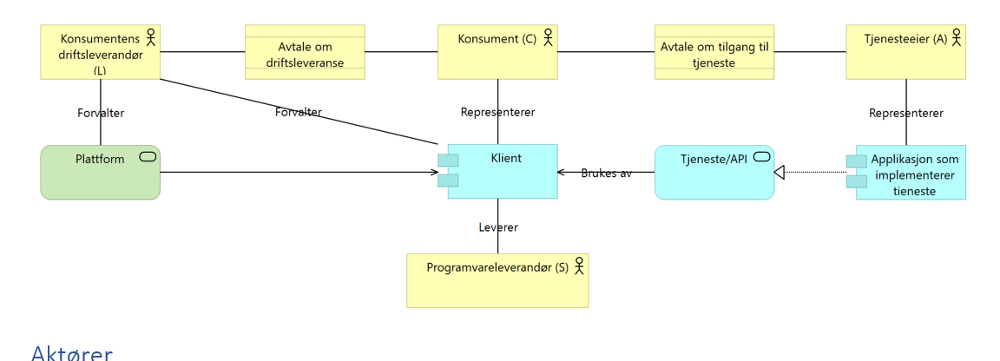

## Description

eOppslag er synkron tilgang til informasjon enten ved henting av informasjon (pull) eller oppdatering av informasjon (push). Dette foregår i sanntid (synkront), hvor svar på en forespørsel gis innenfor få sekunder. Dette kan være å gjøre en spørring i Folkeregisteret. Mønsteret egner seg når en virksomhet har faste og forutsigbare parter, slik som ved oppslag mot et register, der virksomhetene på forhånd kan avtale hvordan og hvor fort mottakers forretningsprosess skal utføres.

## Requirements

## Specification

### Archimate tegning

#### Klaus sin modell:

Merk: bruker EIRA-byggesteiner / notasjon

graph LR

 subgraph API-konsument
  bus1[Exchange of Business Information]
 end

 subgraph API-tilbyder
  bus2[Exchange of Business Information]
 end

 bus1 -- REST-kall --> bus2

 subgraph fellestjenster
  cl[Capability Lookup]
  am[Access Management Service]
 end

#### Rolf sin modell :

### Architectural Description

fyll på

### Aktører:

•	Tjenesteeier (A): den part som tilbyr en tjeneste gjennom et API
•	Konsument (C): den part som skal bruke tjenesten og juridisk sett er mottaker
•	Konsumentens driftsleverandør (L): en separat organisasjon som konsumenten bruker til å forvalte deler av eller hele sin tekniske infrastruktur, samt som i større eller mindre grad er integrert i konsumentens forretningsprosesser. Her begynner det å bli vanskelig, fordi det finnes (minst) tre ulike modeller og det er utydelig hvor grensene går:
1.	C og L er samme organisasjon (eller L sin rolle er ubetydelig i denne sammenhengen): her kan man se bort fra de tre boksene til venstre i figuren (leverandør, plattform, og avtalen med leverandøren) og det hele blir mye enklere
2.	L er en sky-leverandør, men C forvalter klienten selv (for eksempel: C kjøper programvare fra Visma og installerer i Azure. I denne sammenhengen er Microsoft en «databehandler», men fra A sitt perspektiv er L usynlig)
3.	L leverer en integrert tjeneste til C, typisk i en eller annen slags delt løsning, men hvor vi typisk ønsker at L autentiseres som seg selv, men er autorisert til å opptre på vegne av flere C. (for eksempel: Eika opptrer på vegne av 57 banker, et regnskapskontor opptrer på vegne av sine kunder)
•	Programvareleverandør (S): der hvor konsumenten (C) ikke går gjennom en driftsleverandør, men integrerer direkte vil det i mange sammenhenger ikke være C som lager programvaren, men de kjøper for eksempel et ERP-system fra en leverandør, og dette kaller tjenesten. Hvorvidt S er relevant i tilgangsstyringen vil variere.

### Scenario:

Scenario navn	Typisk antall konsumenter	Typisk antall tjenesteeiere	Beskrivelse
Lovhjemlet	1-10	1	Utveksling av informasjon mellom offentlige etater hvor dette er spesifikt hjemlet i lov og forskrift, og hvor den aktuelle informasjonen typisk inngår i definerte prosesser hos alle involverte parter. Et eksempel er utlendingsforvaltningen som er fordelt mellom Politiet, UDI og UNE, og hvor disse utveksler bestemte opplysninger på definerte steder i saksgangen.
Etter avtale	10-1000	1	Oppslag på informasjon hvor bruk av informasjonen er begrenset i lov og forskrift, men med en større bredde i konsumenter og bruksområder, samt definerer bredere grupper av konsumenter («alle kommuner» eller «alle banker»).
Alle virksomheter	Over 1 million	1	Tjenester som alle registrerte virksomheter i prinsippet får lov til å bruke
Revers	1-10	10-1000	Der hvor offentlige etater trenger å kalle tjenester hos private virksomheter for å hente informasjon om disse virksomhetene sine kunder.

### Profile

### Standards

## Recommendations

## Recommendations

## Work-in-Progress

## Løsningsarkitekturer som oppfyller referansearkitekturen

### 1. Oauth2 token-basert sikring

### 2. SOAP med WS-security

### 3. Tovegs TLS klientautentisering

### sikkert ein haug fleire

## Eksemler på bruk av løsningsarkitekturen

###  DSOP forsikring samhandlingsarkitektur

Elektronisk overføring fra NAV til forsikringsselskapene av stønadsinformasjon knyttet til brukere/kunder som er arbeidsuføre
* Redusert saksbehandlingstid både hos NAV og forsikringsselskapene ved å redusere manuelt arbeid i behandlingen av sensitive personopplysninger og rask overføring av informasjon
* Forbedret kunde-/brukeropplevelser med bedre forutsigbarhet og raskere behandlingstid

Overføring av data basert på samtykke gitt av bruker-/kunde, vil sikre riktig håndtering av personopplysninger (understøtter kravene i personvernforordningen)
* NAV deler kun data som forsikringsselskapene må ha for å kunne behandle saken – data minimering
* Selskapene unngår å motta overflødig informasjon som må gjennomgås og slettes
* Bruker kan trekke samtykke når de måtte ønske det

Se eget dokument [LINK]

### DSOP skatteetaens

TODO

## References

I offentlig sektor har vi flere aktører som har fellesløsninger basert på Oauth2/OpenID Connect.   Figuren under viser en overorndet arkitektur, med noen eksemler på koblinger.

graph LR

 subgraph autorisasjonslag
  dataporten
  altinn
  idporten-oidc
  ehelse-as
 end

 subgraph API-lag
  mittapi["Mitt API"]
  dittapi["Annet API"]

  mittapi-. kontrollerer tilgang .- dataporten
  dittapi-. kontrollerer tilgang .- altinn
 end

 subgraph Tjeneste-lab
  subgraph Tradisjonell netttjeneste
    browser
    applikasjonsserver
    browser-->applikasjonsserver
  end
  SPA
  native["Mobil-app"]

  applikasjonsserver-->mittapi
  applikasjonsserver-->dittapi
  applikasjonsserver-- Ber om tilgang --- dataporten
  applikasjonsserver-- Ber om tilgang --- altinn

  SPA-->mittapi
  native-->mittapi
 end

 subgraph autentiseringslag
   idporten
   feide
   fia

   idporten-oidc  --- idporten
   dataporten --- feide
   altinn --- idporten
   ehelse-as --- fia
   fia --- idporten
 end

Nøkkel-egenskaper:

* distribuert arkitektur
* bredde i typer tjenester(konsumenter)
* bredde i typer APIer
* både innbygger-rettede og maskin-rettede tjenester
* både private og offentlige virksomheter

**Mål**:  felles- og sektorløsningene bør være "like", slik at det blir enkelt å bygge tjenster på toppen av dem.

## bruksområder

* autentisering
  * autentiseringsnær autorisasjon
* samtykke/autorisasjon

## Governance

## Eksisternde dokumentasjon tilknytta dei ulike løysingane

* samtykkeløsningen i altinn  [https://altinn.github.io/docs/api/sluttbruker-api/diverse/samtykke/](https://altinn.github.io/docs/api/sluttbruker-api/diverse/samtykke/)
* skatteetaens bruk av altinn samtykkeløsning: [https://skatteetaten.github.io/datasamarbeid-api-dokumentasjon/about_samtykkelosning.html](https://skatteetaten.github.io/datasamarbeid-api-dokumentasjon/about_samtykkelosning.html)
* id-porten oidc [https://difi.github.io/idporten-oidc-dokumentasjon/](https://difi.github.io/idporten-oidc-dokumentasjon/)
* fia [https://fia-sikkerhet.github.io/](https://fia-sikkerhet.github.io/)
* Dataporten [https://docs.dataporten.no/](https://docs.dataporten.no/)

# spørsmål til workshop

* Der løysingane samspeler
  * kva må vi standardisere?
  * kva kan vere forskjellig mellom sektorane
* bruksområde for dei ulike fellesløysingane
* forholdet til private verksemder
